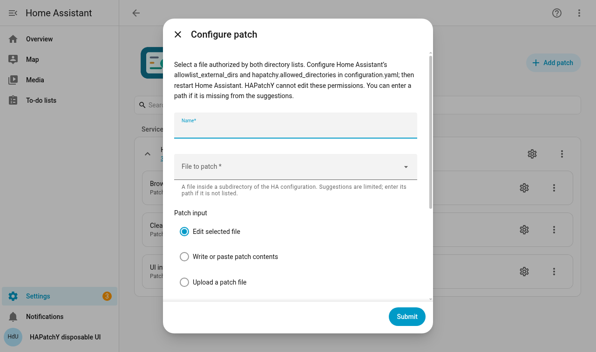

# HAPatchY

> [!CAUTION]
> # ⚠️ WARNING: THIS ENTIRE CODEBASE IS VIBECODED
>
> **All code in this repository was generated by AI coding agents through vibe coding.**
> HAPatchY modifies files in your Home Assistant configuration. Automated tests and
> AI reviews do not guarantee correctness or safety. This is experimental software:
> keep independent backups and try it in a disposable HA installation first.

HAPatchY helps you keep a small, deliberate change to a file after an update
replaces that file. You provide a **patch**: a text file describing which lines
should change and the surrounding lines that identify them. HAPatchY watches the
chosen file and reapplies the change only when the patch matches unambiguously.

For example, if an upstream integration update restores a setting you had changed,
HAPatchY can restore your change automatically. If the upstream code has changed
in a way the patch no longer understands, HAPatchY stops and reports a problem
instead of guessing. Patches for other integrations are **not bundled**.

## Start here

1. Read the [installation guide](docs/installation.md).
2. Follow [Your first patch](docs/first-patch.md): a copy-and-paste example using
   an unused text file, with the expected result at each step.
3. Use the [settings and actions reference](docs/reference.md) when configuring
   a real patch, and [troubleshooting and recovery](docs/troubleshooting.md) if
   something goes wrong.

The operator first authorizes destination folders in `configuration.yaml` using
[both directory lists](docs/directory-permissions.md), then restarts HA. You
configure each patch from **Settings → Devices & services**. Select the target
file from HA’s configuration, then paste a patch into the editor or upload a
`.patch`/`.diff` file. HAPatchY saves it and lets you edit it later. Existing local
patch files and direct HTTPS URLs remain available as advanced inputs. Each patch has a
status sensor; Home Assistant's Repairs page reports problems. The YAML contains
only operator-owned directory grants, not patch definitions. There is no custom
dashboard to install.

HTTPS sources require a public hostname whose DNS answers are all public
addresses; numeric hosts, local-network destinations and redirects are refused.
See the [source rules](docs/reference.md#local-files-and-https).

This screenshot shows a local development installation, not a HACS certification.

## Before using it

- HAPatchY supports **one existing UTF-8 text file per patch**, inside the HA
  configuration directory. It cannot patch HA's installed core or files elsewhere
  on the host. You can save a rule for a missing file and wait for it to appear.
- A patch needs enough unchanged context to identify the intended location.
  There is no fuzzy matching, forced application, or multi-file patch support.
- No directory is authorized by default. Both HA's explicit
  `allowlist_external_dirs` and HAPatchY's `allowed_directories` must permit
  the target and watch directory; see [directory permissions](docs/directory-permissions.md).
- Automatic application, startup checks and backups are enabled by default.
  The introductory example explains how to start with automatic application off.
- Changing a Python file on disk may require an HA restart to affect running
  code. **HAPatchY never restarts HA for you.**
- Removing HAPatchY does **not** undo changes to files. Use the checked Revert
  action first when appropriate; see the [removal instructions](docs/troubleshooting.md#remove-a-patch-or-uninstall-hapatchy).

## Compatibility

| Tested HA baseline | Python in that test environment |
| --- | --- |
| **2025.3.0** — minimum supported HA | 3.13.12 |
| **2026.9.0** — development baseline | 3.14.7 |

The same integration code is tested at both endpoints. Intermediate HA releases
have not been individually tested. Your installed HA supplies Python: **HACS does
not download a separate Python interpreter or create a HAPatchY virtual environment**.
The Dev Container's Python 3.14 requirement does not raise the product minimum.

## Installation and release status

HAPatchY is experimental. Use a published version from
[GitHub Releases](https://github.com/Ryther/hapatchy/releases) when one is available.
If there is no release, the manual source-install path is for development/testing.
HACS installation/update has not yet been verified; default-store inclusion is not claimed.
See [installation](docs/installation.md) for the exercised manual path and
[verification](docs/verification.md) for the checks performed on this revision.

## Help and development

For help, start with [troubleshooting](docs/troubleshooting.md). When opening a
[GitHub issue](https://github.com/Ryther/hapatchy/issues), include versions, the
sensor status and a small sanitized example. Review diagnostics before sharing.

For contributors: [contribution rules](CONTRIBUTING.md),
[development and architecture](docs/architecture.md),
[Dev Container guide](.devcontainer/README.md), and
[versioning and releases](docs/releasing.md). The container starts an isolated HA;
automated tests do not need access to your household installation. Problems with
external PRs must be reproduced in this Dev Container before being attributed
to the contribution.

## License

[MIT](LICENSE), copyright 2026 Ryther. Dependencies retain their own licenses.
Third-party integrations are not bundled with HAPatchY.
