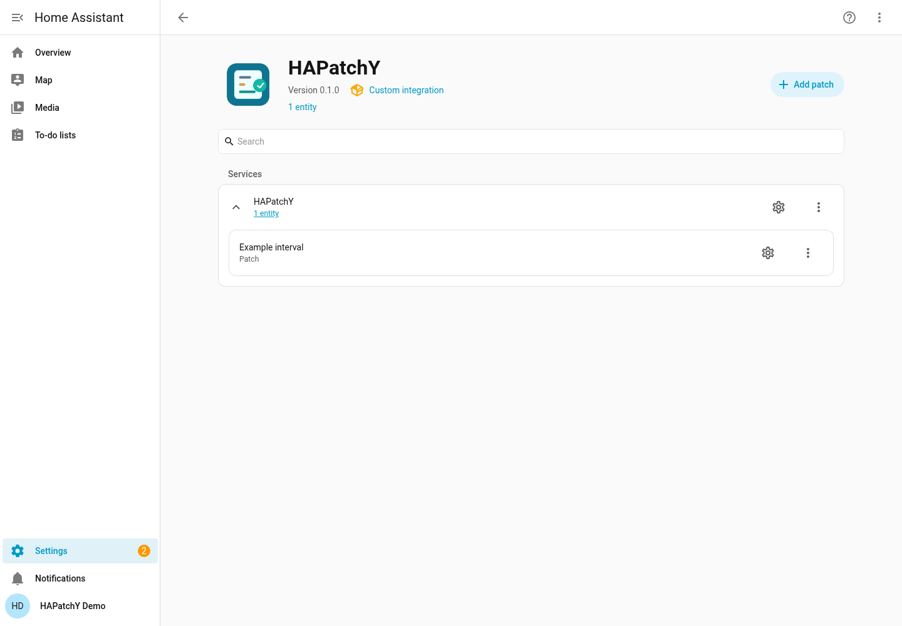

# HAPatchY

> [!CAUTION]
> # ⚠️ WARNING: THIS ENTIRE CODEBASE IS VIBECODED
>
> **All code in this repository was generated by AI coding agents through vibe coding.**
> HAPatchY modifies files in your Home Assistant configuration. Automated tests and
> AI code reviews do not guarantee correctness or safety. Treat this initial
> implementation as experimental: review the code and your patches, keep independent
> backups, and test in a disposable HA installation before using it in your home.

Manage exact, single-file unified patches from Home Assistant. HAPatchY watches
configured files, checks whether a patch applies, and can reapply it after an
upstream update. Configuration, status sensors, Repairs and administrator actions
use Home Assistant's native interface. No custom frontend is required.

**Status:** initial implementation, undergoing release acceptance. Local tests
and hassfest pass; a published release and clean HACS installation have not yet
been verified. HAPatchY is not in the HACS default store.

## Compatibility

| Test baseline | Python used by HA |
| --- | --- |
| Home Assistant 2025.3.0 (minimum) | 3.13.12 |
| Home Assistant 2026.9.0 (recent development baseline) | 3.14.7 |

The same product code is tested at both endpoints. Intermediate HA releases have
not been individually tested. HACS copies the integration into your HA installation.
**HAPatchY uses Home Assistant's Python interpreter and process.** HACS does not
install another Python version or create a private integration venv. The two
venvs in the Dev Container are development environments only.

## Installation and setup

For local development, copy `custom_components/hapatchy` to your HA configuration's
`custom_components` directory, then restart HA. The Dev Container links this
folder automatically. Open **Settings → Devices & services → Add integration →
HAPatchY**, then add a patch from the integration's menu.

After the repository and a release are published, the intended HACS procedure is:
add `https://github.com/Ryther/hapatchy` as a custom repository of type
**Integration**, download HAPatchY, restart HA, and follow the setup above. This
procedure still requires clean-install acceptance before release. There is no
working release/import badge to advertise yet.

Only one HAPatchY integration entry is needed. Each patch is a native subentry
with one status sensor. Add, reconfigure and remove patches through the native
integration UI. English and Italian translations are included. Local branding is
supported by HA 2026.3 and later; older HA versions may show a placeholder icon.



Captured from the isolated development HA; this is a manual development
installation, not a HACS acceptance receipt.

## Configure a patch

All file paths use `/` separators and are relative to the HA configuration
directory. For example, a target `scripts/example.py` can use watch root `scripts`
and a local patch at `patches/example.patch`.

| Field | Meaning / default |
| --- | --- |
| Name | Display name for the patch |
| Target path | One regular file to patch; a missing file requires confirmation |
| Watch root | Explicit subdirectory containing the target; never the configuration root |
| Watch pattern | Watchdog pattern relative to that root; defaults to the target's relative path |
| Source type / source | Local patch path or HTTPS URL |
| Source SHA-256 | Optional digest of the exact downloaded/read patch bytes |
| Enabled | `true`; disabled patches remain visible without watching or applying |
| Auto apply | `true`; reconciliation applies an unambiguous forward patch |
| Reconcile on startup | `true`; check when the integration starts |
| Backup before apply | `true`; disabling requires an explicit warning confirmation |
| Debounce seconds | `1.5`, allowed range `0.1–60` |

Duplicate targets are rejected, including targets belonging to disabled patches.
Conflicts or missing targets require confirmation when saving; saving does not
force an unsafe application. Entry options set backup retention per patch
(default **10**, allowed **1–100**).

Use a UTF-8 unified diff whose old and new headers identify the configured target
(optionally with paired `a/` and `b/` prefixes). Include enough unchanged context
to distinguish the intended block from similar blocks. HAPatchY uses exact
matching with unique placement; it never performs fuzzy or forced application.
It supports multiple non-overlapping hunks in one file, LF or uniform CRLF targets,
and explicit missing-final-newline markers. Binary patches, file creation,
deletion, renaming and multi-file patches are rejected.

HTTPS sources use a 30-second timeout and do not follow redirects. Patch data is
limited to 2 MiB and target/output data to 16 MiB. A failed fetch or digest check
never falls back to a stale cached patch. Updating a local source alone does not
trigger a target watch; use **Refresh source** or **Reconcile** afterward.

## Status, Repairs and actions

| Sensor status | Meaning |
| --- | --- |
| `unknown` | No check yet |
| `disabled` | Patch is disabled |
| `applicable` | A unique forward application is possible |
| `applied` | A unique reverse match identifies the patched state |
| `conflict` | Neither direction matches uniquely |
| `missing_target` | Target does not exist |
| `source_error` | Source could not be loaded or verified |
| `invalid_patch` | Unsupported, malformed or ambiguous patch |
| `security_error` | A path or file safety check failed |
| `apply_error` | Write, backup or durability verification failed |

Attributes include `patch_id`, check/application timestamps, hashes, watch
availability and `restart_may_be_required`. Repairs explain failures and missing
watch roots. Missing/replaced roots are checked periodically (every 60 seconds);
HAPatchY never widens a watch to the whole configuration directory.

Use **Developer tools → Actions** as an administrator. Copy `patch_id` from the
sensor attributes; entity IDs and file paths are not action identifiers.

| Action | Behavior |
| --- | --- |
| `hapatchy.reconcile` | Check one patch, or all enabled patches when `patch_id` is omitted; respect auto apply |
| `hapatchy.apply` | Explicitly apply one enabled patch if uniquely applicable |
| `hapatchy.revert` | First turn auto apply off in native configuration, then attempt an exact reverse patch with a mandatory backup |
| `hapatchy.refresh_source` | Fetch and validate one patch; never write the target |

```yaml
action: hapatchy.reconcile
data:
  patch_id: "copy-the-id-from-your-sensor"
```

Revert is not an unconditional backup restore. It fails if the current file is
not uniquely reversible, leaving auto apply off. Re-enable auto apply explicitly
when you want reconciliation to apply the patch again.

## Backups, updates and recovery

Backups and metadata live under `.hapatchy/backups/<patch_id>/` in the HA
configuration directory. HAPatchY writes and syncs backups before replacing a
target, preserves its permissions/ownership and uses an atomic sibling-file
replacement. Retention prunes completed backups only after successful writes.
A post-replacement sync failure remains an error until durability is confirmed.

Symlinks, hard-linked files, special files, traversal, `.storage`, HAPatchY's own
code and its backup directory are not valid patch targets. Operations are
serialized. Snapshot checks detect changes during preparation, but there is an
unavoidable final-check-to-replace window against independent writers: use
quiescent updates, not concurrent editors or adversarial filesystem writers.

Changes to Python files may require **an HA restart to affect already imported
code**. HAPatchY flags this and never restarts HA automatically. Disk status is
not evidence that HA has loaded the changed code.

When an update changes the relevant context, review the new upstream file and
revise the patch. Do not overwrite unrelated upstream changes with an old
backup. Download diagnostics from the integration menu when reporting a problem;
include HA/HAPatchY versions, status and a small sanitized reproducer. Diagnostics
exclude file bodies and full source URLs, but still review paths/hostnames before
sharing them. Full configured URLs remain in native HA configuration storage.

Removing a patch, unloading the integration or uninstalling it **does not revert
modified files or delete backups**. Perform a checked revert first if desired,
then remove configuration and integration files. Keep backups until recovery is
no longer needed.

## Development and contribution

Open in VS Code Dev Containers with Docker running. Home Assistant starts
automatically; open forwarded port **8123** (choose another host port if occupied).
No existing HA instance is needed for tests. Tests construct temporary HA objects
and temporary configuration directories using the HA pytest plugin.

```bash
.venv/bin/python -m pytest -q
.venv/bin/ruff check custom_components tests .devcontainer/scripts .devcontainer/tests script
.venv/bin/mypy --python-version 3.14
python3 -m unittest discover -s .devcontainer/tests -v
bash .devcontainer/scripts/status-ha.sh
bash .devcontainer/scripts/stop-ha.sh
bash .devcontainer/scripts/start-ha.sh
```

See the [development guide](.devcontainer/README.md),
[architecture](docs/architecture.md) and [release procedure](docs/releasing.md).
CI runs independent locked minimum/recent environments; do not install the
minimum lock over the running development environment.

Product code and tests use **Python**. Supporting files use **Bash, Dockerfile,
JSON, YAML, TOML, INI and Markdown**, with PNG branding. There is no owned
JavaScript/TypeScript frontend. The default-deny `.gitignore` admits authored
paths only; add narrow exceptions for new files. State, credentials, caches,
venvs and local planning evidence stay excluded.

## License

[MIT](LICENSE), copyright 2026 Ryther. Dependencies retain their own licenses.
Third-party integrations are not bundled or modified as part of installation.
