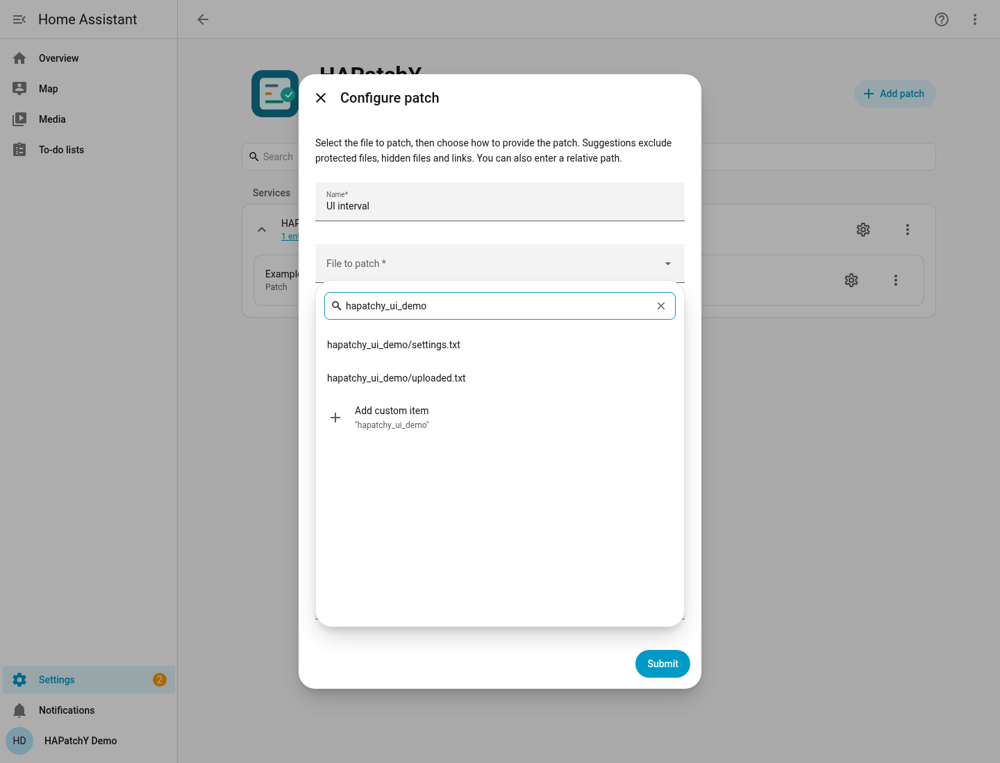
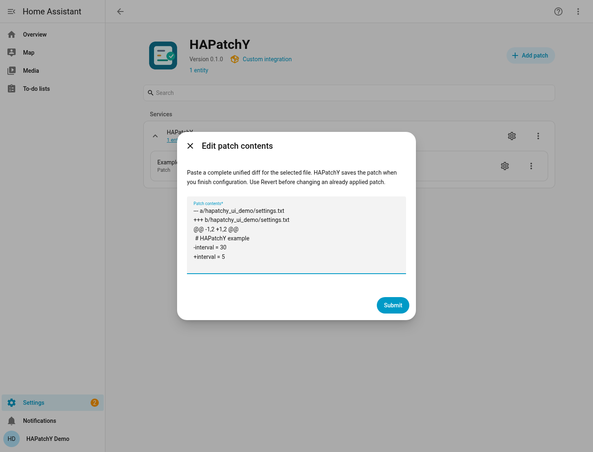
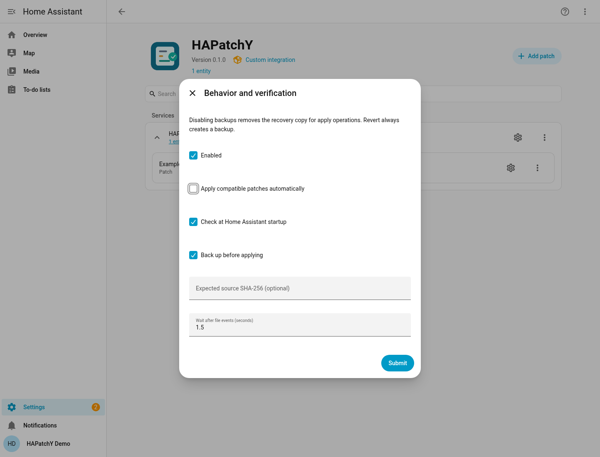
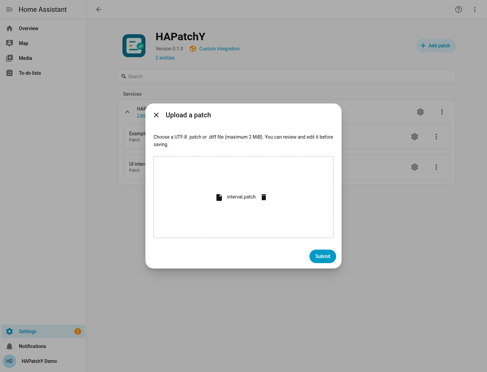
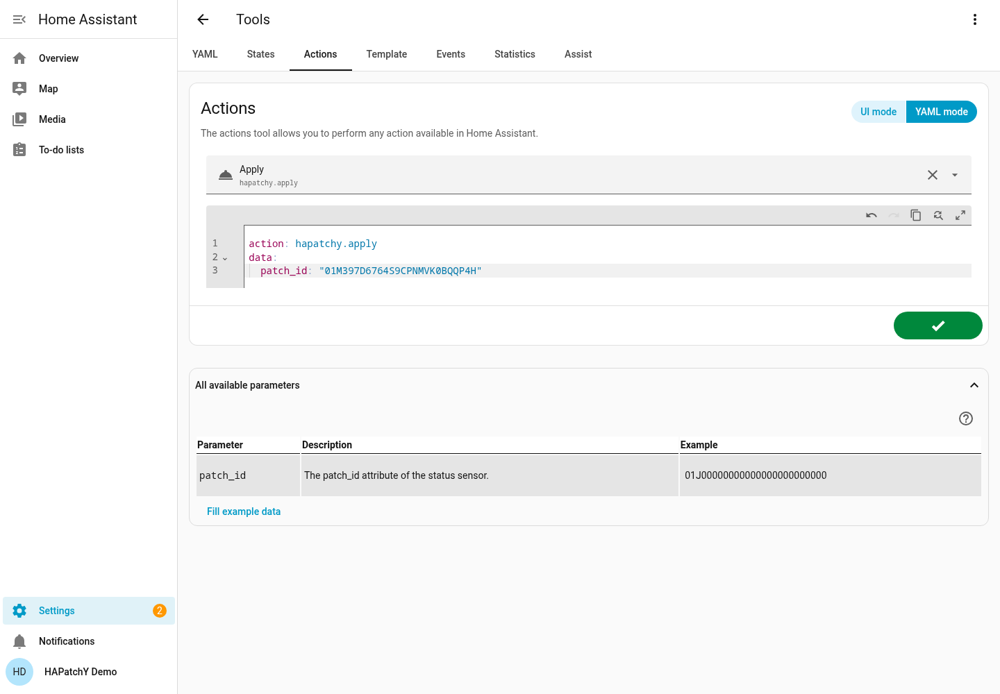
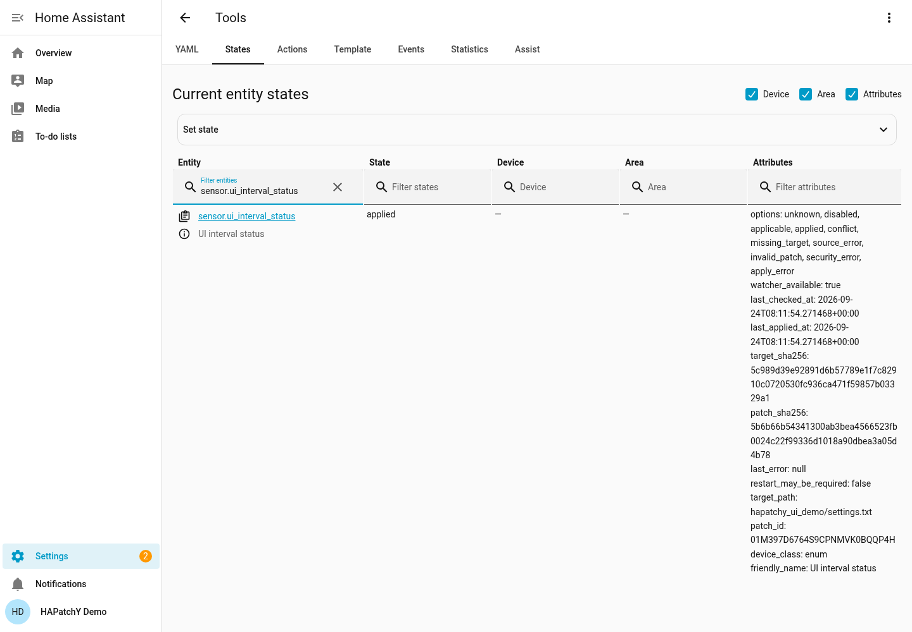
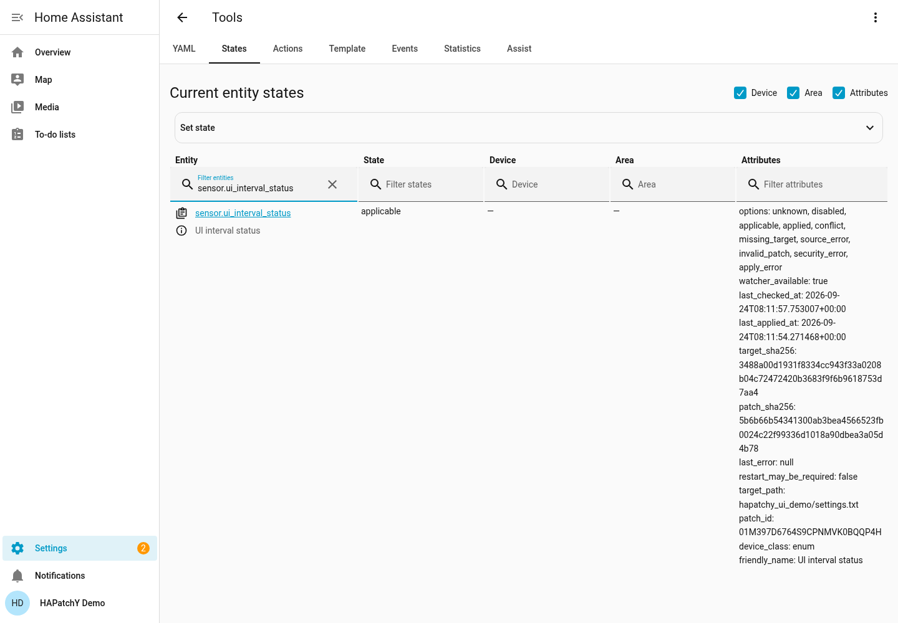
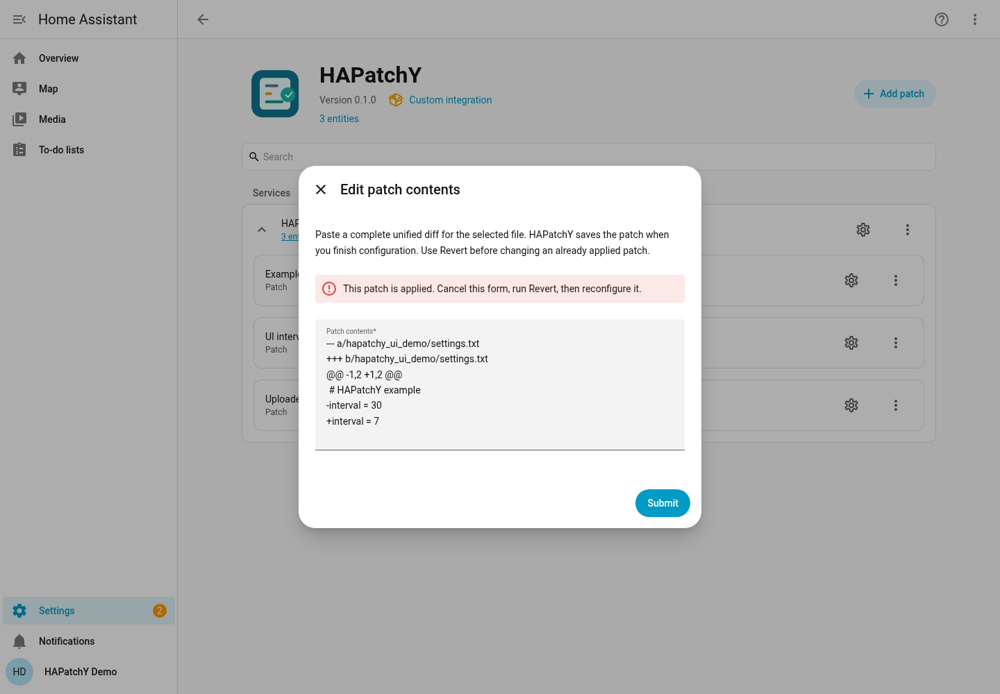
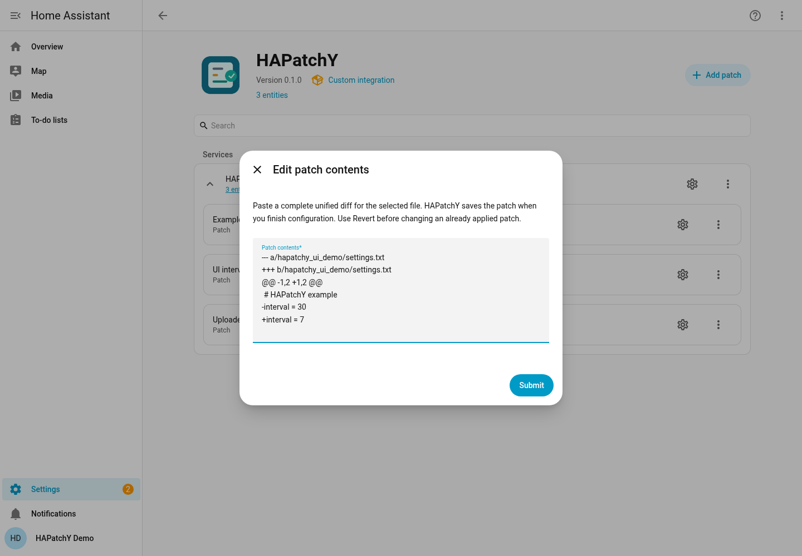
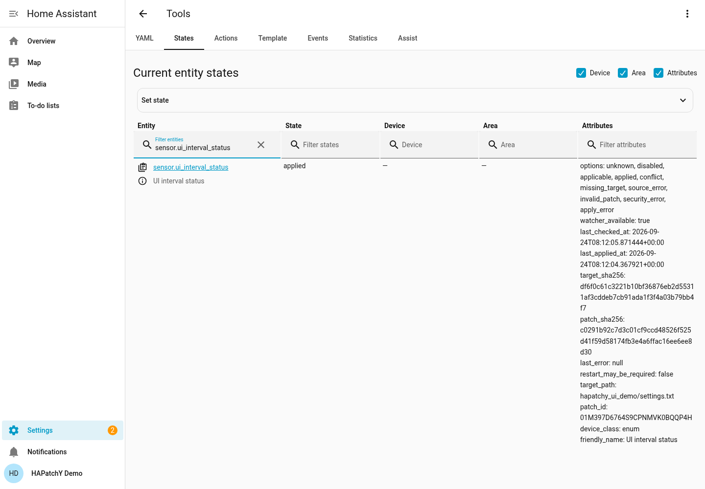

# Your first patch

[← Installation](installation.md) · [Settings reference →](reference.md)

This exercise changes an unused text file from `interval = 30` to `interval = 5`.
**Home Assistant does not read this demo file**, so no device or integration is
changed. You select the target in HA, paste the patch, then try Apply and Revert.
You do not need to create a patch file in HA's configuration folder.

The steps and screenshots were exercised in Chromium on HA **2026.9.0**,
HAPatchY **0.1.0**, on 24 September 2026. The target bytes were checked too.
See [verification details and limitations](verification.md). This HA version
calls Developer tools **Tools**.

## 1. Prepare an unused target

In your HA configuration folder, create `hapatchy_ui_demo/settings.txt` with
exactly these two lines and a newline after the last line:

```text
# HAPatchY example
interval = 30
```

Use a plain-text editor and UTF-8 encoding, or download [settings.txt](examples/settings.txt).
This is the **target**: the existing file HAPatchY will modify. For a real patch,
the target would already exist, for example inside another custom integration.
The file picker selects files on HA's server, not files on your computer.

## 2. Select the target in HA

Open **Settings → Devices & services → HAPatchY → Add patch**.

- Set **Name** to `UI interval`.
- Open **File to patch**, search for `hapatchy_ui_demo`, and select
  `hapatchy_ui_demo/settings.txt`.
- Keep **Write or paste patch contents** selected.
- Leave **Watch directory** and **Watch pattern** empty. HAPatchY will watch
  the selected file's parent directory and match that file.



Only files inside permitted subdirectories are suggested. If an eligible file
is absent from the limited list, type its full configuration-relative path and
choose **Add custom item**. Paths are validated again when submitted.

Select **Submit** to open the patch editor.

## 3. Paste and save the patch

Paste this complete unified diff into **Patch contents**:

```diff
--- a/hapatchy_ui_demo/settings.txt
+++ b/hapatchy_ui_demo/settings.txt
@@ -1,2 +1,2 @@
 # HAPatchY example
-interval = 30
+interval = 5
```

Keep the **one leading space** before `# HAPatchY example` and the final newline.
Do not copy the Markdown fence lines. The first two lines name the target;
`-` removes a line, `+` adds a line, and the space marks unchanged context.
The `@@` line describes the hunk's line counts. For real patches, obtain a
correct unified diff from the author rather than inventing those counts.



Select **Submit**. On **Behavior and verification**:

- Keep **Enabled**, **Check at Home Assistant startup**, and **Back up before applying** on.
- Turn **Apply compatible patches automatically** **off** for this exercise.
- Leave the SHA-256 empty and the wait at **1.5 seconds**.
- Select **Submit**, then **Finish**.



HAPatchY now stores the patch in its own `.hapatchy/patches/` directory.
Before the final submit, editing does not save a managed patch or change the
target. With automatic application and startup checking enabled, saving can
start an apply immediately; that is why this tutorial turns automatic application off.

The new sensor, **UI interval status**, should become **Applicable**. The target
still contains `interval = 30`. A brief `unknown` state before the check is normal.


### Prefer uploading a patch file?

At step 2 choose **Upload a patch file** instead. Select a UTF-8 `.patch` or
`.diff` from your computer (maximum **2 MiB**) and submit. HA then opens the same
editor with the uploaded contents, so you can review or change them before saving.



The upload test used a second target, `hapatchy_ui_demo/uploaded.txt`, containing
the same original two lines. Its patch headers named that second file. For the
main tutorial target, you can use [interval.patch](examples/interval.patch).
The patch headers must match whichever target you selected. Uploading a patch
does not upload or replace the target itself.

## 4. Apply once, then revert

1. Open **Developer tools → States**, find `sensor.ui_interval_status`, and copy
   its **`patch_id`** attribute. This is different from the sensor's entity ID.
2. Open **Developer tools → Actions** and choose **HAPatchY: Apply**.
3. Enter that ID into **Patch ID** and perform the action.

In YAML mode, substitute your own ID:

```yaml
action: hapatchy.apply
data:
  patch_id: "paste-your-patch-id-here"
```



The sensor becomes **Applied**, the file contains `interval = 5`, and a backup
is retained under `.hapatchy/backups/<patch_id>/`. Your file editor may need
**Show hidden files** to display that folder.



Run **HAPatchY: Revert** with the same ID. The target returns to `interval = 30`
and the status becomes **Applicable**. Revert disables automatic application
and keeps it off. It reverses the current patch only when the target matches
exactly, making a mandatory backup; it does not blindly restore an old backup.



## 5. Edit a saved patch

Use **Reconfigure patch** beside `UI interval`. Keep the target and the
**Write or paste patch contents** choice, then submit. The editor contains the
saved patch. Change `+interval = 5` to `+interval = 7` and submit.

If the patch is still applied, HAPatchY asks you to cancel, run Revert and reopen
the form. The old patch remains configured so Revert can still use it.



After Revert, the edit can be saved. HAPatchY keeps the previous patch revision
and gives the new contents their own file; it does not overwrite the old revision.
The rule and sensor keep their identity.



## 6. Try automatic reapplication

While saving that edit, turn **Apply compatible patches automatically** on and
keep the startup check on. Saving reloads the integration; the file should now
contain `interval = 7`.

Replace the demo target with its original two lines (`interval = 30`). Wait a
few seconds: HAPatchY should restore `interval = 7` and show **Applied**.



This exercises the watcher, not an actual HACS update. An upstream update that
changes the context can correctly produce **Conflict** instead. Review that
version and obtain an updated patch; do not force the old change.

Finish with **Revert** so this demo remains inactive. To remove it, follow the
[cleanup instructions](troubleshooting.md#remove-a-patch-or-uninstall-hapatchy).
Removing a rule does not undo its target changes or delete its retained files.
