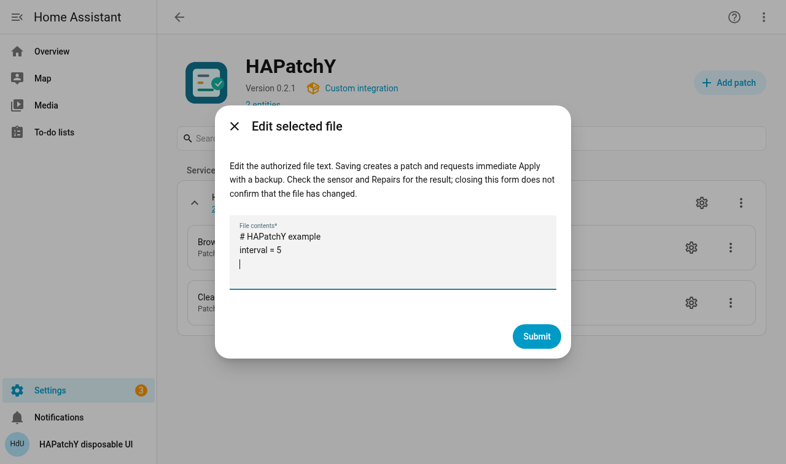
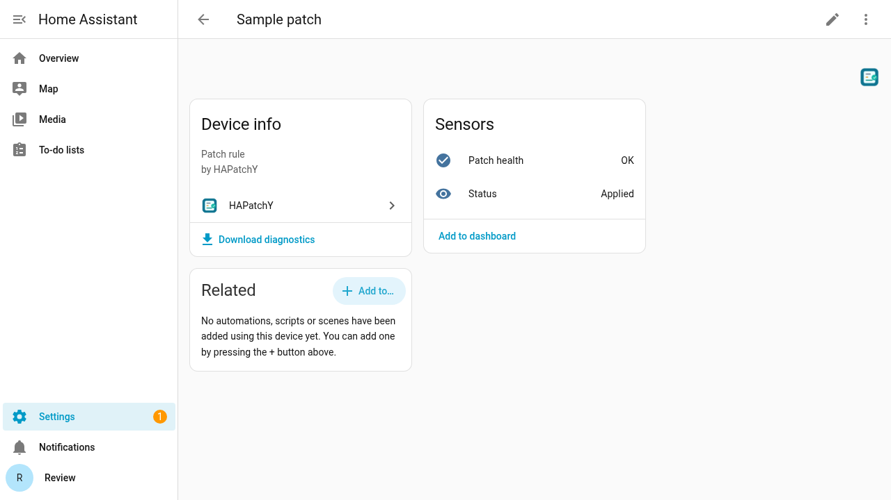
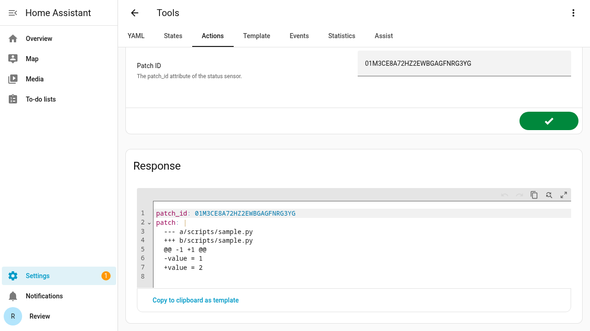
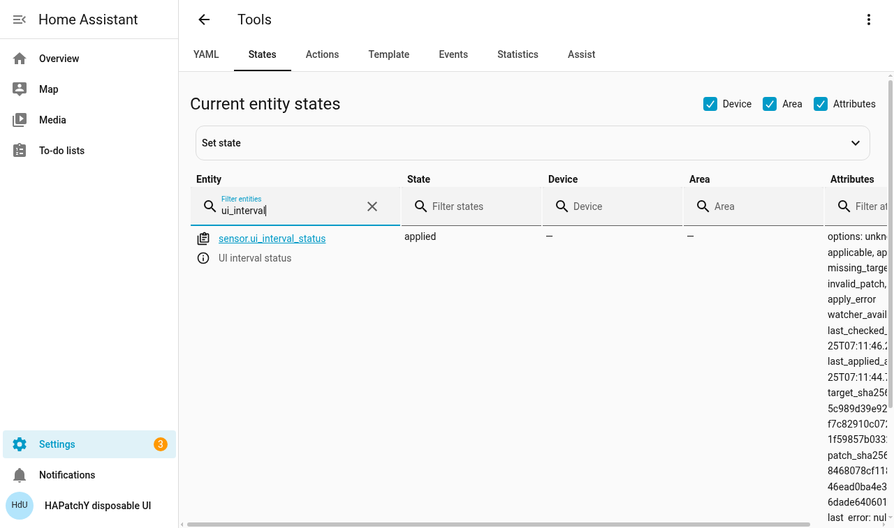

# Your first patch

[← Installation](installation.md) · [Settings reference →](reference.md)

This walkthrough changes an **unused** text file from `interval = 30` to
`interval = 5`. Home Assistant does not read the demo file, so no device or
integration changes. The default Add patch flow shows the file in a text editor,
creates a unified diff for you, then requests Apply with a backup. You do not
need to write a `.patch` file.

The editor flow was performed in Chromium on disposable HA **2026.9.0** on
25 September 2026 using the development source. The browser captures used
`scripts/interval.txt` with the same text below; the applied target and retained
backup were checked byte for byte. The same native API flow also passed the HA
boot smoke test, including a failed-write status check. This does not certify a
published HACS release or a change to another integration.

## 1. Prepare and authorize the target

In your HA configuration folder, create `hapatchy_ui_demo/settings.txt` with
exactly these two lines **and a newline after the last line**:

```text
# HAPatchY example
interval = 30
```

Use a plain-text UTF-8 editor, or download [settings.txt](examples/settings.txt).
The configuration folder is the one containing `configuration.yaml`; the file
picker selects files on **HA's server**, not your computer.

Authorize the `hapatchy_ui_demo` folder in **both** YAML directory lists and
restart HA as shown in the [directory-permissions guide](directory-permissions.md).
The same grant also permits an HA administrator using this flow to **read the
file's full contents**. Grant only folders whose contents may be read and patched
through the administrator API. HAPatchY cannot approve a folder from its form.

## 2. Select the file

Open **Settings → Devices & services → HAPatchY → Add patch**.

1. Set **Name** to `UI interval`.
2. Select **File to patch** → `hapatchy_ui_demo/settings.txt`.
3. Keep the default **Edit selected file** input.
4. Leave **Watch directory** and **Watch pattern** empty. The selected file's
   parent directory and exact filename are used.
5. Select **Submit**.

The picker lists only a bounded set of eligible files. If yours is absent,
enter its configuration-relative path, such as `hapatchy_ui_demo/settings.txt`,
and select **Add custom item**. The backend checks the path and both grants again.
A brief loading screen can appear before the editor opens.

## 3. Edit, save, and check the result

The **File contents** field is prefilled from the authorized target. Change only
`interval = 30` to `interval = 5`; keep the comment and final newline. Select
**Submit** and then **Finish**. The editor accepts a nonempty UTF-8 file up to
**512 KiB**, with LF line endings and a final newline. It refuses binary text,
CRLF, missing final newlines and edits whose generated diff cannot be applied
and reversed unambiguously. Use a patch-file input for a supported file that the
editor cannot handle.

This field is Home Assistant's plain multiline text area. It does not show line
numbers, syntax highlighting, or a live diff. You edit the complete file text;
HAPatchY generates and validates the unified diff when you submit the form.
Keep a copy of substantial edits until the status sensor confirms Apply.



HAPatchY saves the generated diff as a managed patch, enables startup checking
and automatic application, and requires a backup. **“Created configuration”
means the rule was saved; it does not mean Apply succeeded.** Open **Developer
tools → States** and find `sensor.ui_interval_status` (or open the new patch
device). Wait for **`applied`** and check the target file itself. A brief `unknown`
state is normal. If the sensor reports `apply_error`, `conflict` or
`security_error`, inspect **Settings → System → Repairs** and follow
the [troubleshooting guidance](troubleshooting.md); do not assume the file
changed. The device's **Patch health** binary sensor displays **Problem** for
these errors and **OK** otherwise. Its raw states are `on` and `off` for
automations; it does not contain the patch text.



To inspect the exact current diff, copy `patch_id` from **Developer tools →
States**, then open **Developer tools → Actions → HAPatchY: View patch**. Enter
that ID and perform the action. The response contains the unified diff; this
read leaves the target file unchanged. Review its contents before sharing it.





The demo target should now contain `interval = 5`. A recovery copy of its
**original** bytes is retained under `.hapatchy/backups/<patch_id>/` inside the
HA configuration folder. This is HAPatchY's internal folder; you need not create
or edit it. Your file editor may need **Show hidden files** to display it. Keep a
separate full HA backup as well.

## 4. Revert and clean up

Find the sensor's **`patch_id`** attribute in Developer tools → States. This ID
is different from the sensor's entity ID. Open **Developer tools → Actions**,
choose **HAPatchY: Revert**, enter the ID and perform the action. In YAML mode:

```yaml
action: hapatchy.revert
data:
  patch_id: "paste-your-patch-id-here"
```

Check that the target is back to `interval = 30` and the sensor is `applicable`.
Revert makes a backup of the pre-revert bytes and disables automatic
reapplication. It reverses only an exact match; it does not blindly restore an
old backup. You can then remove the rule from the HAPatchY integration page.
Removing a rule without Revert does **not** undo its target change or delete
retained backups and patch revisions.

## Prefer to supply a `.patch` file?

Choose **Write or paste patch contents** or **Upload a patch file** at step 2.
These existing methods open a diff editor, then **Behavior and verification**.
For a first manual test, keep backup and startup checking on, turn automatic
application off, save the rule, confirm `applicable`, and run **HAPatchY: Apply**
from Developer tools using the sensor's `patch_id`. Its status should become
`applied`. Upload accepts a UTF-8 `.patch` or `.diff` file up to **2 MiB** from
your computer; it does not upload or replace the target itself. You can use the
[ready-made example](examples/interval.patch).

The complete diff for this target is:

```diff
--- a/hapatchy_ui_demo/settings.txt
+++ b/hapatchy_ui_demo/settings.txt
@@ -1,2 +1,2 @@
 # HAPatchY example
-interval = 30
+interval = 5
```

Keep the **leading space** before `# HAPatchY example` and a final newline.
The `---` and `+++` paths must match the selected target. Do not copy Markdown
fences into a patch file. Paste the diff into a plain-text editor on your
computer and save it as `interval.patch` in UTF-8, or use the downloaded example.
If your target already has an editor-created rule, Revert and remove it before
adding a new rule for the same file; duplicate target paths are rejected.

For a real file, make two copies on your computer: `original.txt` containing the
current HA bytes and `desired.txt` containing only the intended change. Leave
the HA target untouched. On Linux or in the Dev Container, GNU `diff` generates
the correct hunk counts:

```sh
diff -u \
  --label a/hapatchy_ui_demo/settings.txt \
  --label b/hapatchy_ui_demo/settings.txt \
  original.txt desired.txt > interval.patch
```

Replace both label paths with your target's configuration-relative path, keeping
`a/` and `b/`. `diff` exits **1** when it finds differences; that is expected.
Exit **0** creates an empty patch, and any other exit needs investigation. Review
the output before upload: it must describe one existing target, use the correct
headers, and contain only the intended change. An upstream change to the target
can cause a conflict; HAPatchY will not force an ambiguous match.

## Edit an existing rule or try automatic reapplication

**Edit selected file** creates a new rule. To change a saved managed diff, use
**Reconfigure patch** and **Write or paste patch contents**. If that diff is
already applied, first run Revert and verify the target; the old revision stays
available for exact reversal. HAPatchY retains previous managed revisions when
you save an edit.

With automatic application enabled, replacing a target with its exact original
bytes should cause HAPatchY to reapply a matching diff after the watcher settles.
This is useful after an upstream update, but a changed context may instead
produce `conflict`. Review the upstream version and obtain a new patch; never
force the old change. Python files already loaded by HA may require an HA restart
after their bytes change. HAPatchY does not restart HA for you.
