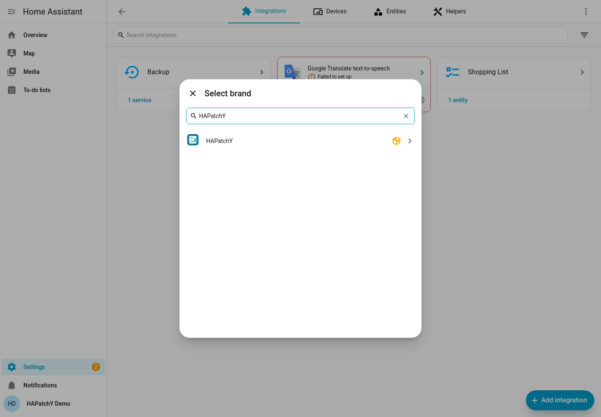
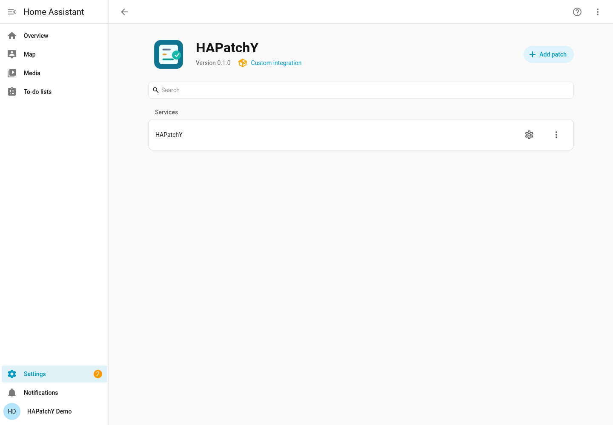

# Install HAPatchY

[← Documentation home](../README.md) · [Next: your first patch →](first-patch.md)

## What you need

- Home Assistant **2025.3.0 or newer** and an administrator account.
- A backup of your HA configuration and a separate copy of any file you plan to
  change. HAPatchY's per-file backups are not a replacement for a full HA backup.
- A way to edit files in the **HA configuration directory**. Use an editor or file
  share you already trust. This guide does not require terminal access.

The configuration directory is the folder containing `configuration.yaml`.
For HA OS and common container setups it is exposed inside HA as `/config`;
your editor or host may display a different location. Use the actual configuration
folder, not a folder that merely happens to have the same name on your computer.

HAPatchY paths are relative to this folder. If a file is
`/config/python_scripts/example.py`, enter `python_scripts/example.py`, without
`/config/` and without a leading slash. Do not edit HA's `.storage` files.

## HACS availability

A HACS installation/update has **not yet been exercised for this repository**.
This guide therefore does not present an untested HACS click sequence. Use the
manual source-install path below for development testing. HACS instructions will
be added after a real install from the public repository has been verified.

## Manual installation

This path was exercised with a copy of the integration source in a separate HA
2026.9.0 configuration, followed by startup and native UI setup. It used the
existing development Python environment; it did not test dependency downloads
on a fresh HA OS installation. See [the verification record](verification.md).

1. Download/clone this repository for development testing. Once a public release
   exists, its integration archive can provide the same folder; installation from
   a published release has not yet been tested.
2. Locate `custom_components/hapatchy` inside the download.
3. Copy that **entire `hapatchy` folder** into your HA configuration's
   `custom_components` directory. Create `custom_components` if necessary.
4. Check the final layout:

   ```text
   configuration.yaml
   custom_components/
     hapatchy/
       __init__.py
       manifest.json
       config_flow.py
       ...the other integration files...
   ```

   Avoid an extra directory such as `custom_components/hapatchy/hapatchy`.
   Do not copy the development environment, tests or repository root over your HA
   configuration. From the release ZIP, extract only the integration folder.
5. Restart Home Assistant.

HA installs the integration's declared Python dependencies using its own runtime.
You do not need to install Python, run `pip`, or create a venv inside your HA
installation. Internet access may be required for dependency installation.

## Add the integration

1. Sign in as an administrator.
2. Open **Settings → Devices & services → Add integration**.
3. Search for **HAPatchY**, select it, submit the confirmation form and select **Finish**.
4. Open the HAPatchY integration page. You should see **Add patch**.





Create HAPatchY only once. Multiple patches live inside that one integration.
No sensor appears until you add a patch. Continue with
[Your first patch](first-patch.md) before configuring an important file.

If HAPatchY is missing from the search, check the folder layout, restart HA and
read **Settings → System → Logs**. A custom-integration warning is normal; an
import or dependency error needs investigation. See
[troubleshooting](troubleshooting.md#hapatchy-does-not-appear-or-fails-to-load).

## Updates

A real HACS update and replacement with a newer released HAPatchY version remain
unverified. Do not treat the local file-replacement exercise in the first-patch
tutorial as an integration upgrade test. Release-specific update instructions
will be documented after that exercise is completed.
