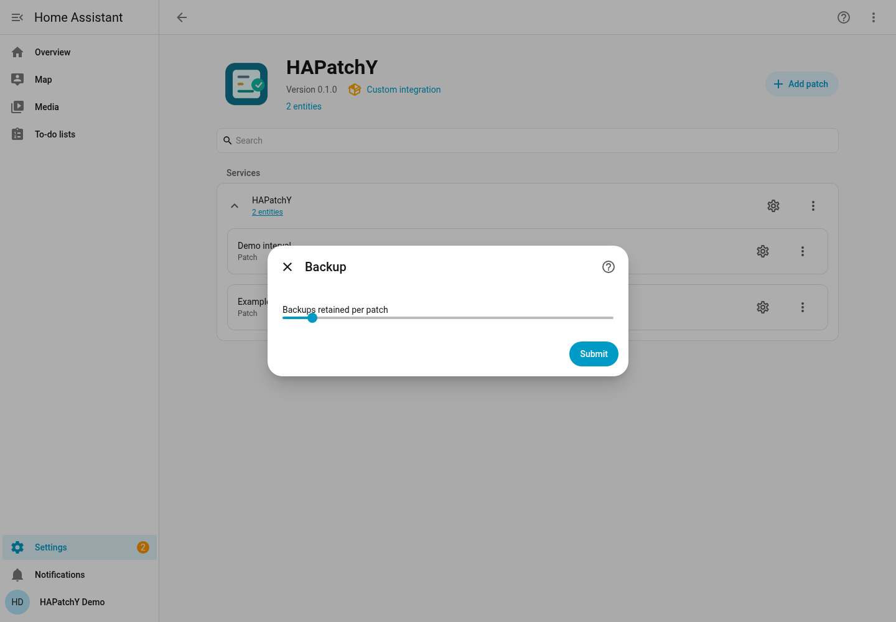

# Settings, status and actions

[← Documentation home](../README.md) · [First-patch tutorial](first-patch.md)

The local-source UI operations below were exercised on HA 2026.9.0.
[Verification and screenshots](verification.md) separate those observations
from contracts covered only by automated tests.

## Patch settings

Each item added with **Add patch** is an independent rule with its own sensor.
Use its settings/menu to reconfigure or remove it. Keep one HAPatchY integration
entry; you do not need a separate integration for each file.

| Setting | Meaning | Default / limit |
| --- | --- | --- |
| Name | A label you will recognize in HA | Required |
| Target path | File that will be changed, relative to HA's configuration folder | One regular text file |
| Watch directory | Existing directory containing the target; monitored recursively | Explicit subdirectory, never the configuration root |
| Watch pattern | A Watchdog glob pattern relative to the watch directory | Empty selects the target's relative path |
| Source type | `local` for a file in the configuration folder, `url` for HTTPS | `local` |
| Source | Patch file path or direct HTTPS URL; never the target itself | Required |
| Enabled | Allows checks, watching and actions for this rule | On |
| Apply compatible patches automatically | Reconcile applies a patch when safe | On |
| Check at Home Assistant startup | Check when HAPatchY starts or reloads | On |
| Back up before applying | Keep original bytes before an apply | On; turning it off requires confirmation |
| Expected source SHA-256 | Optional fingerprint of the exact patch bytes | Empty; otherwise 64 hexadecimal characters |
| Wait after file events | Wait for an update to settle before checking it | 1.5 seconds; 0.1–60 allowed |

A pattern can narrow event handling but never allows patching additional files.
Even if the pattern is `*.py`, the rule changes only its configured target.
Duplicate target paths are rejected, including those in disabled rules.

**Enabled off** and **automatic application off** have different meanings:
with the former, actions are rejected and no watch is installed; with the latter,
checks still report status and you can explicitly Apply from Developer tools.

The integration's options (rather than an individual patch's settings) contain
**backup retention**: completed backups to keep **per patch**, default 10,
minimum 1, maximum 100. Removing a patch does not delete its backups.



## Local files and HTTPS

Local paths always use `/` separators and start inside the HA configuration
folder. Absolute paths, `..`, symlinks, hard links and special files are rejected.
`.storage`, `.hapatchy` and HAPatchY's own integration files are protected.

A URL must be a direct **HTTPS** link to the patch text. A GitHub file-view page
is HTML, not a patch download. Redirects are rejected; resolve them to a direct
trusted URL first. Credentials embedded in a URL are not supported. A configured
URL may contain a query string, which remains in HA's configuration storage even
though full URLs are omitted from HAPatchY diagnostics.

A SHA-256 fingerprint detects unexpected source changes; it does not establish
that the author is trustworthy. When you deliberately update a pinned patch,
review the new contents and update its fingerprint too. A failed source request
or fingerprint check never reuses an old cached patch.

Editing the **patch source** does not trigger the target watch. After editing it,
use **Refresh source** to check it or **Reconcile** to check and, if enabled, apply.

## Status sensor

Open the integration's entity list or **Developer tools → States**. UI translations
may display friendly labels; the raw state values below are stable identifiers.

| State | What it means | Your next step |
| --- | --- | --- |
| `unknown` | No completed check yet | Wait for startup or run Reconcile |
| `disabled` | The rule is disabled | Enable it if you want it active |
| `applicable` | A unique forward change is possible | Apply explicitly, or enable automatic application |
| `applied` | The current file matches the patched state in reverse | Nothing to write; Python changes may still need an HA restart |
| `conflict` | Neither direction matches uniquely | Review upstream changes; obtain an updated patch |
| `missing_target` | The target does not exist | Check the path or wait for installation/update to finish |
| `source_error` | The patch could not be read, downloaded or verified | Check source, connectivity and SHA-256 |
| `invalid_patch` | The diff is malformed, unsupported or ambiguous | Regenerate it with correct headers and distinctive context |
| `security_error` | A path/file safety check failed | Use a permitted regular file and directory |
| `apply_error` | A backup, write or durability check failed | Read the Repair; do not assume no bytes changed |

Useful attributes include:

- `patch_id`: the generated ID to use in actions, not the sensor entity ID.
- `target_path`: the configured target, relative to the HA configuration folder.
- `watcher_available`: whether the watch root is currently available.
- `last_checked_at` / `last_applied_at`: timestamps of the last check / apply.
- `target_sha256` / `patch_sha256`: fingerprints recorded at the last check.
- `last_error`: a controlled error reason; see Repairs and logs for context.
- `restart_may_be_required`: a Python file changed during this HA process.

A status describes the last completed check, not continuous proof of the current
file contents. A missing watch root can produce a Repair even when a previous
status was `applied`. Missing/replaced roots are rechecked every 60 seconds.

## Administrator actions

Use **Developer tools → Actions**. These actions require administrator access;
trusted internal HA automations can also call them. Ordinary users are denied.
Copy the ID from the patch's sensor before running an action.

| Action | Required input | Effect |
| --- | --- | --- |
| `hapatchy.reconcile` | Optional `patch_id` | Check one rule, or every enabled rule if omitted; respect automatic application |
| `hapatchy.apply` | `patch_id` | Explicitly apply one enabled patch if uniquely applicable |
| `hapatchy.revert` | `patch_id` | Turn automatic application off in configuration, then attempt an exact reversal with a mandatory backup |
| `hapatchy.refresh_source` | `patch_id` | Fetch/read and validate the source and current target; never modify the target |

For all enabled patches:

```yaml
action: hapatchy.reconcile
data: {}
```

For one patch, substitute its actual ID:

```yaml
action: hapatchy.refresh_source
data:
  patch_id: "paste-your-patch-id-here"
```

Revert keeps automatic application **off even if reversal fails**. This prevents
an immediate reapplication; turn it back on yourself when appropriate. Revert
uses the currently configured patch, so keep the original patch source when you
expect to reverse it later. It does not restore arbitrary backup files.

## Supported patch format and limits

Use a UTF-8 single-file unified diff. Old and new headers must name the target,
optionally using paired `a/` and `b/` prefixes. Context must identify each hunk
uniquely; nominal line numbers do not resolve repeated identical blocks.

Multiple non-overlapping hunks, LF or uniform CRLF targets, and explicit
missing-final-newline markers are supported. Mixed line endings, binary data,
file creation/deletion/renaming, multiple target files, no-op and unanchored
hunks are rejected. HAPatchY never invokes a shell patch command or runs the
patched file. It cannot determine whether a text change is semantically correct
Python or safe for the upstream integration.

Limits: patch source **2 MiB**, target/result **16 MiB**, HTTPS timeout **30 seconds**.
Writes preserve target permissions/ownership and use atomic replacement. Snapshot
checks detect concurrent changes during preparation, but independent writers can
still race between the final check and replacement. Let upstream updates finish;
do not edit the target concurrently with an active apply/revert.
