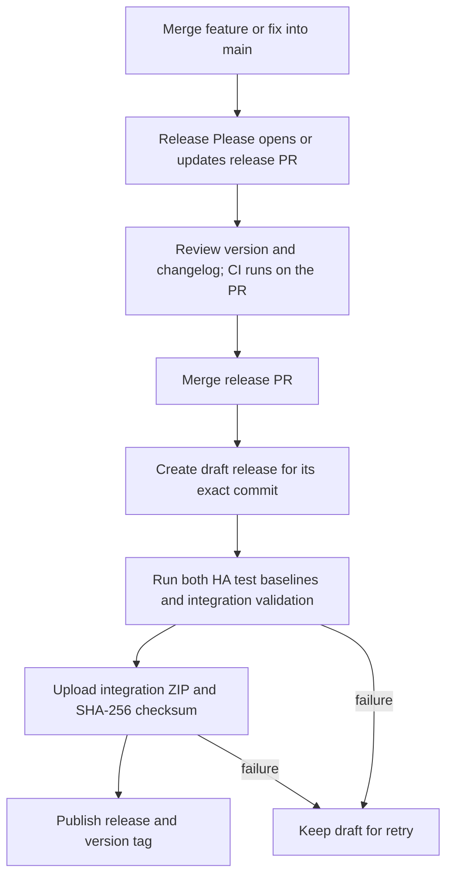

# Versioning and releases

[← Documentation home](../README.md) · [Development guide](architecture.md)

This page is for maintainers. Users should follow [installation](installation.md).
The automation is defined in [release.yaml](../.github/workflows/release.yaml);
this document describes that workflow, not a record of releases already performed.

## The normal path



Ordinary feature merges update a **release PR**, not a published release. Review
that PR as the decision to release: confirm the version, changelog, supported HA
versions and any outstanding manual acceptance. The workflow does not auto-merge it.
After you merge it, successful validation and asset upload lead to publication.

The publisher checks out and tests the draft's **full commit SHA**, even if `main`
has moved ahead. It requires that commit to belong to `origin/main`. It refuses a
moving branch as a release target, mismatched versions/tags, a dirty checkout, an
existing tag pointing elsewhere, or an already-published release. Drafts are created
without forcing a Git tag before validation.

## One-time GitHub setup

1. Make **`main`** the repository's default branch and put the workflow/configuration
   files on it. These workflows intentionally target `main`.
2. Enable GitHub Actions. Under **Settings → Actions → General**, permit Actions
   to create pull requests if repository/organization policy requires it.
3. Add an Actions secret named **`RELEASE_PLEASE_TOKEN`**. Use a fine-grained PAT
   scoped to this repository with **Contents**, **Pull requests** and **Issues**
   read/write permissions (metadata read is implicit). Issues permission is used
   for release labels. Treat it as a repository automation credential and rotate
   it before expiry. Never commit its value or place it in a workflow file.
4. Keep the repository's Issues enabled and complete the metadata required by HACS
   (description/topics and valid HACS metadata). The HACS validation job reports
   missing requirements; it is not a clean-install test.
5. Require the **Tests** matrix and **Integration validation** checks in the branch
   rules for `main`, using the check names shown after their first GitHub run.
   Review/squash-merge feature PRs with Conventional Commit titles.
6. Inspect the first release PR and its checks before merging. In disposable HA
   installations, perform the manual acceptance checks listed below.

Why a separate token? GitHub suppresses most workflow events caused by the built-in
`GITHUB_TOKEN`. Release Please needs a credential whose PR creation/update triggers
normal PR checks. The prepare job fails clearly if the secret is missing; it does
not silently create an unchecked PR. The publication job uses the built-in token
with only `contents: write` and runs in the same workflow, so it does not rely on
a second tag-triggered workflow. See
[Release Please credentials](https://github.com/googleapis/release-please-action#github-credentials)
and [GitHub workflow triggering](https://docs.github.com/en/actions/how-tos/write-workflows/choose-when-workflows-run/trigger-a-workflow).

The checked-in workflows have local tests and static validation. Their presence
alone does not prove that GitHub settings, credentials or a remote release run are
working. Confirm those on the repository's Actions page after setup.

## How the version is chosen

Use Conventional Commits in the commits that reach `main` (usually squash-merge titles):

| Example | Version effect |
| --- | --- |
| `fix: preserve a patch after a directory replacement` | Patch release |
| `feat: add a supported source type` | Minor release |
| `feat!: change patch configuration format` | Breaking release |
| `docs: clarify backup recovery` | Does not by itself request a new release |

Before 1.0, a breaking change bumps the minor version because
`bump-minor-pre-major` is enabled; features also bump the minor version. At 1.0 and
later, breaking changes bump the major version. This pipeline currently accepts
stable `MAJOR.MINOR.PATCH` versions and `vMAJOR.MINOR.PATCH` tags, not prerelease suffixes.
A 0.x version still denotes an evolving, experimental product.

[release-please-config.json](../release-please-config.json) configures the Python
release strategy and an extra JSON update for HA's manifest. The release PR keeps
these three values equal:

- `pyproject.toml` → `[project].version`
- `custom_components/hapatchy/manifest.json` → `version`
- `.release-please-manifest.json` → `"."`

The initial development baseline is **0.1.0**. With the existing feature commits,
the first automatically calculated release is normally **0.2.0**; 0.1.0 is not
being asserted as a previously published release. Review the PR rather than
creating a synthetic old tag. Subsequent versions are based on release history.
[CHANGELOG.md](../CHANGELOG.md) is maintained by Release Please; review its generated
entries for accuracy and add useful migration/recovery notes to the release PR.

## What gets validated and published

[Tests](../.github/workflows/tests.yaml) is reusable by the release workflow and
runs the locked HA/Python minimum and recent lanes, product/release tests, Ruff,
mypy, environment unit tests and a local archive build.
[Integration validation](../.github/workflows/validation.yaml) runs pinned hassfest
against the selected source checkout and HACS's repository validator. HACS's
remote metadata check follows its event/repository context; it is not evidence of
installing the draft or of testing every HACS interaction at the selected SHA.

After both workflows succeed, [release_github.py](../script/release_github.py)
rechecks draft identity and builds:

```text
hapatchy-X.Y.Z.zip
hapatchy-X.Y.Z.zip.sha256
```

The ZIP contains tracked `custom_components/hapatchy/` files and `LICENSE`, using
repository-relative paths. Development state, tests, credentials, untracked files
and planning evidence are excluded. The checksum uses the usual `sha256sum` format.
Both uploaded asset digests are checked before the draft is published. Published
releases and existing tags are never replaced by this helper.

HACS uses the repository's integration layout: `hacs.json` does **not** enable
`zip_release`. The attached ZIP is also available for manual installation; do not
change HACS to ZIP mode without defining/testing that separate asset-layout contract.

To inspect an archive locally, from a checkout with the version changes present:

```bash
python script/build_release.py
# To additionally require a particular version:
python script/build_release.py --tag v0.2.0
# Replace the filename with the version actually built:
cd dist
sha256sum --check hapatchy-0.2.0.zip.sha256
```

The builder does not bump versions, create a tag or publish anything. Local builds
use tracked working-copy contents, which may be edited; the publishing helper
separately requires a clean committed checkout. ZIP timestamps and permissions
are fixed so repeated builds with the same source/toolchain produce the same bytes.

## Recover a failed run

A failed check or upload leaves a draft. The next run on `main` first finds an
unfinished stable-version draft and retries it **before** asking Release Please
to create another PR. This also avoids confusing release history while a draft
has no published tag.

To retry explicitly, open **Actions → Release → Run workflow**, choose `main` and
enter the existing draft tag in **resume_tag**, for example `v0.2.0`. The workflow
re-reads its SHA and reruns all release checks. Leaving the input empty uses the
normal discovery/PR path. If multiple drafts exist, select one explicitly and
resolve the others intentionally.

- If a transient dependency/API failure caused the problem, retry after fixing it.
- If checks fail because of code, merging a fix into `main` does not rewrite the
  old draft's commit. Inspect the failed candidate and prepare a corrected release;
  do not assume a retry magically tests the newer commit.
- If an asset with the expected name already exists, a retry keeps it only when its
  SHA-256 matches. Different bytes or a missing digest stop publication. Inspect
  the draft manually before removing a bad asset; the workflow never uses clobber.
- If the release is already published, the helper refuses to modify it. Correct
  mistakes in a new version instead of moving its tag or replacing its assets.

## Manual acceptance before merging a release PR

Automation verifies code, packaging and repository metadata. It cannot prove
correct behavior in every installation. For the initial release and changes to
installation/update behavior, record results from disposable HA environments:

1. Install via HACS on the supported minimum and recent baselines; restart and
   complete native entry/patch setup.
2. Exercise a harmless apply/revert, check status and Repairs, and inspect diagnostics.
3. For a real third-party patch, perform the actual upstream update through HACS
   and check safe reapplication or a conflict. A copied-file simulation is useful
   but is not that same acceptance test.
4. Check backups, reload/unload behavior, removal and the documented recovery path.
5. Review release notes and any compatibility change before merging the release PR.

Record actual versions and outcomes in the PR/release discussion without secrets.
Do not mark these checks complete solely because an automated workflow is green.
