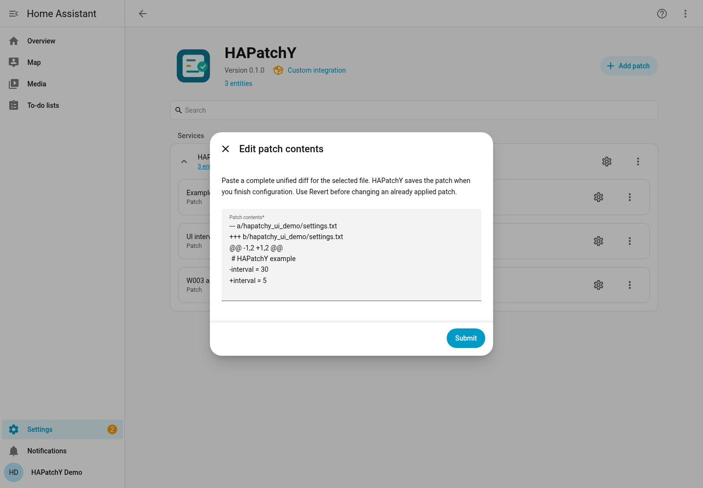
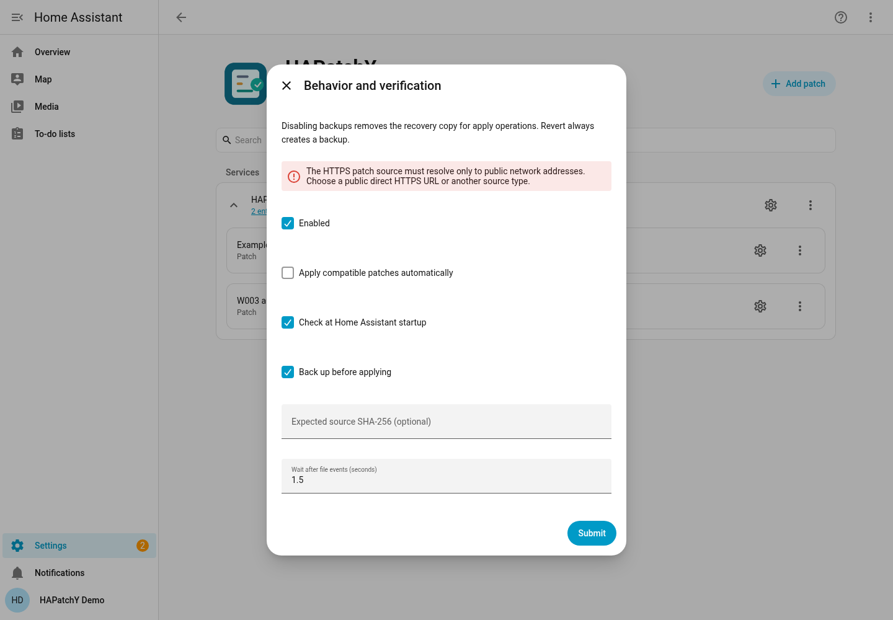

# Verification of this revision

[← Documentation home](../README.md) · [Your first patch](first-patch.md)

On **25 September 2026**, an isolated reproduction of the v0.2.0 **Add patch**
picker used 500 eligible files under `custom_components` and 100 YAML files in
an include directory. The v0.2.0 scan took **8.99 seconds** and left **507 file
descriptors open**, up from 6 before enumeration. The corrected code returned
the same 500 suggestions in **0.059 seconds** and left the descriptor count at
4 before and after enumeration. Separate processes account for the different
starting counts. A regression test scans nested include directories 20 times
and checks that the descriptor count does not rise. These are disposable
fixtures, not measurements from a household HA installation. The picker form
and fields remain as shown in the screenshot below.

On **25 September 2026**, the target picker was checked against a slow-opening
case in a disposable HA 2026.9.0 / Python 3.14.7 process. Opening the native
**Add patch** flow with 500 eligible files took **0.146 seconds** and left the
sample target's bytes unchanged. A separate synthetic case with 500 eligible
files and 100 included YAML files took **8.11 seconds before** the read-only
policy-check change and **0.071 seconds after** it on the same development
machine. These timings describe those fixtures, not a guaranteed response time
for every installation. In a fresh browser session against disposable HA, the
same **Add patch** form appeared in **0.393 seconds** with 500 eligible files.
Regression tests cover bounded YAML rescans and refusal when configuration
changes during enumeration. The rendered fields did not change; the published
screenshot below shows that same form from the preceding browser walkthrough.
Both locked test lanes passed **295 pytest tests**, Ruff, mypy, 13 Dev
Container unit tests and the release archive build. Separate disposable HA
processes on **2025.3.0 / Python 3.13.12** and **2026.9.0 / Python 3.14.7**
passed the managed-patch Apply, Revert and denied-target byte checks. The
browser timing was measured only on the newer lane.

On **24 September 2026**, the preceding product revision ran in the Dev
Container's disposable **Home Assistant 2026.9.0 / Python 3.14.7**. The
operator YAML contained explicit
`homeassistant.allowlist_external_dirs` and `hapatchy.allowed_directories` entries
for two test directories. After restarting HA, the integration loaded and the
current Add patch form displayed the two-list requirement:

The [first-patch tutorial](first-patch.md) was repeated end to end in the actual
browser UI. The picker selected `hapatchy_ui_demo/settings.txt`, whose starting
bytes were exactly `# HAPatchY example\ninterval = 30\n`. Pasting the documented
diff with automatic application off created the `UI interval` rule and an
`applicable` sensor without changing those bytes. **HAPatchY: Apply** changed
the file to `interval = 5`; **HAPatchY: Revert** restored `interval = 30`. Both
actions were invoked through Developer tools, and disk bytes were checked after
each action. A backup was present after Apply.

Reconfigure reopened the saved diff. Editing it to `+interval = 7` and enabling
automatic application saved a new immutable revision and changed the target to
`interval = 7`. Restoring the original target bytes triggered the watcher, which
reapplied `interval = 7`. A final Revert restored the original bytes. The rule
was then removed through the UI. Separately, uploading the documented
`interval.patch` filled the editor with those bytes, saved an `applicable` rule
without altering the target, and was removed through the UI.

The same browser flow rejected `https://127.0.0.1/patch` with the translated
network-destination error during final configuration. No rule was saved and the
target bytes remained unchanged. This confirms the visible error for a literal
loopback URL; isolated resolver/connector tests cover private, mixed and
non-global DNS answers without contacting those addresses.

A native subentry-flow test seeded a previously saved loopback URL, then tried
to change it to a managed source. Reconfiguration was denied before any target
write. Removing the old rule and adding a managed rule with automatic application
off succeeded, again with the original target bytes unchanged. The browser UI
cannot create such a legacy rule in this revision, so that recovery branch was
verified through the native flow API rather than a new screenshot. Separate
runtime checks loaded that saved legacy rule, reported `security_error` at
startup, and refused Apply, Revert and Refresh source without changing bytes.
Loader tests exercised a public DNS answer through the actual connector with a
synthetic failed dial and proxy settings present. They checked that the dial
retained the original TLS hostname and an SSL context; a certificate error was
injected rather than produced by a TLS handshake. Another test returned HTTP
200 through the real loader using a test-only transport redirected to an
offline loopback server. DNS, stream cancellation and post-download timeout
tests checked cleanup and controlled errors. No public server was contacted.

An earlier native editor flow also created a managed patch for
`scripts/w003_authorization_demo.txt` with automatic application disabled. The
sensor became `applicable` while disk contained `value = old`. Apply changed
the file to `value = new`; Revert restored `value = old`. Each result was checked
against the target bytes, not inferred from the sensor alone. The native-flow
API refused a target in unlisted `www/` with `hapatchy_path_not_allowed` and
unchanged bytes. Changing `configuration.yaml` while HA was running caused
Apply to be refused without changing the target. Restoring the YAML and
restarting HA restored the loaded integration.

The separate CI smoke booted HA 2025.3.0/Python 3.13.12 and
HA 2026.9.0/Python 3.14.7 from pinned runtime inputs, each with a fresh
temporary configuration. In both processes it completed onboarding, created
a managed patch through HA's native API, checked bytes after Apply and Revert,
and confirmed that a target outside both grants was refused with unchanged
bytes. These smoke checks passed locally and in the GitHub-hosted
[Tests run for product commit `36ff7c9`](https://github.com/Ryther/hapatchy/actions/runs/36022163070).

| Environment | 24 September baseline checks |
| --- | --- |
| HA 2025.3.0 / Python 3.13.12 | 293 pytest tests, Ruff, mypy and 13 Dev Container unit tests passed |
| HA 2026.9.0 / Python 3.14.7 | Browser walkthrough above; 293 pytest tests, Ruff, mypy and 13 Dev Container unit tests passed |

The pinned hassfest image reported **0 invalid integrations** after the
translation changes. The pinned actionlint image accepted the workflow files.
The release archive builder completed on both test lanes. These checks were
also covered by the GitHub-hosted Tests and
[Integration validation](https://github.com/Ryther/hapatchy/actions/runs/36022604170)
runs. After the repository became public, that validation run passed its local
metadata, hassfest and HACS Action jobs. HACS Action validates the published
repository metadata; it does not install or update HAPatchY in HA.

The [v0.2.0 release workflow](https://github.com/Ryther/hapatchy/actions/runs/36026824446)
passed both test and boot-smoke lanes against commit `e3e9fb2`, plus HACS,
hassfest, metadata, workflow lint and secret checks. The published tag resolves
to that commit, and GitHub reports the release as immutable. Both release
assets were downloaded; `sha256sum --check hapatchy-0.2.0.zip.sha256` passed.
The downloaded ZIP was then extracted into a fresh disposable HA 2026.9.0
setup. Its native API flow saved a managed patch, Apply and Revert produced the
expected disk bytes, and a target outside the grants was refused. This tested
the published archive, not a HACS installation or a fresh HA OS dependency
download.

The screenshots show rendered forms and statuses. Separate disk-byte checks
establish the specific writes above. The minimum HA lane was exercised by
automated tests and the functional API smoke, not by a separate browser session.
The HTTPS browser check used a denied loopback URL, not a live public HTTPS
service. This record does not represent a HACS installation or HACS update.
